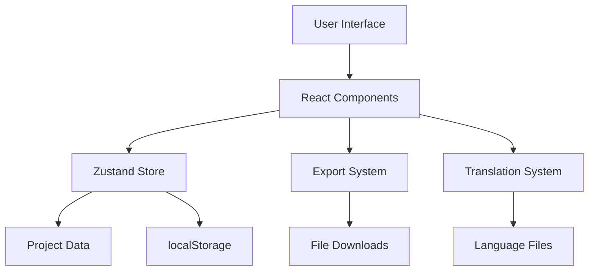

# System Overview

## 🎯 Project Mission

MADLAB is a collaborative educational project between MADFAM and La Ciencia Del Juego, focused on bringing gamified science and technology learning to primary schools in Mexico. The project addresses topics aligned with global Sustainable Development Goals (SDGs) and Mexican national competency standards.

## 📊 Project Specifications

- **Duration**: 81 days (August 11 - October 31, 2025)
- **Target Audience**: 20-100 students per 3-hour presentation
- **Team Size**: 5 members across two organizations
- **Focus Areas**: Clean water, clean energy, and recycling
- **Tasks**: 109 tasks across 5 project phases

## 🏗️ System Architecture

### High-Level Architecture



### Technology Stack

#### Frontend Framework
- **React 18**: Modern hooks, concurrent features, and Suspense
- **TypeScript**: Full type safety and enhanced developer experience
- **Vite**: Lightning-fast build system and HMR

#### State Management
- **Zustand**: Lightweight, flexible state management
- **Persistence**: localStorage integration for settings
- **Immutable Updates**: Predictable state changes

#### Styling & UI
- **Tailwind CSS**: Utility-first CSS framework
- **Custom Properties**: Consistent theming system
- **Responsive Design**: Mobile-first approach
- **Dark Mode**: System preference detection

#### Utilities & Libraries
- **Lucide React**: Consistent icon library
- **Export System**: Multi-format data export (PDF/CSV/JSON/TXT)
- **Performance**: Built-in monitoring and optimization

## 🔄 Data Flow Architecture

### 1. Static Data Layer
```typescript
// Project data (read-only)
const projectData = {
  tasks: Task[],      // 109 tasks with full metadata
  phases: Phase[],    // 5 project phases
  team: Member[],     // 5 team members
  translations: {}    // Bilingual content
};
```

### 2. State Management Layer
```typescript
// Zustand store (reactive)
interface AppState {
  theme: 'auto' | 'light' | 'dark';
  language: 'es' | 'en';
  viewMode: 'grid' | 'list';
  filters: FilterState;
  collapsedPhases: Set<number>;
}
```

### 3. Component Layer
```typescript
// React components (UI)
- App (root container)
- Header (navigation & settings)
- FilterBar (search & filters)
- PhaseSection (phase management)
- TaskCard (task display)
- ExportModal (data export)
```

## 🎨 UI/UX Architecture

### Design System
- **Color Palette**: Blue/indigo primary with gray neutrals
- **Typography**: System fonts with responsive sizing
- **Spacing**: Consistent 4px grid system
- **Animations**: Smooth transitions and loading states

### Responsive Breakpoints
```css
/* Mobile-first approach */
sm: 640px   /* Small devices */
md: 768px   /* Tablets */
lg: 1024px  /* Laptops */
xl: 1280px  /* Desktops */
2xl: 1536px /* Large screens */
```

### Accessibility Features
- **ARIA Labels**: Screen reader support
- **Keyboard Navigation**: Full keyboard accessibility
- **Color Contrast**: WCAG AA compliant
- **Touch Targets**: Minimum 44px for mobile

## 🚀 Performance Architecture

### Bundle Optimization
- **Code Splitting**: Automatic route-based splitting
- **Tree Shaking**: Unused code elimination
- **Asset Optimization**: Automatic image and CSS optimization
- **Lazy Loading**: Components loaded on demand

### Runtime Performance
- **React Optimization**: Memo, useMemo, useCallback
- **State Optimization**: Minimal re-renders
- **Animation Performance**: RequestAnimationFrame usage
- **Memory Management**: Cleanup on unmount

## 🔒 Security Architecture

### Client-Side Security
- **Type Safety**: TypeScript prevents runtime errors
- **Input Validation**: User input sanitization
- **XSS Prevention**: React's built-in XSS protection
- **Content Security**: No external script dependencies

### Data Security
- **No Sensitive Data**: All data is educational content
- **Local Storage**: Non-sensitive settings only
- **Export Security**: Client-side file generation
- **No Server Communication**: Zero external API calls

## 📈 Scalability Considerations

### Horizontal Scaling
- **Component Modularity**: Easy to add new features
- **Translation System**: Simple to add new languages
- **Export System**: Extensible format support
- **Theme System**: Easy custom theme addition

### Performance Scaling
- **Virtual Scrolling**: Ready for large task lists
- **Pagination**: Can be added for massive datasets
- **Caching**: Built-in browser caching
- **CDN Ready**: Static assets optimized for CDN

## 🔧 Development Architecture

### Development Workflow
```bash
npm run dev      # Development server
npm run build    # Production build
npm run preview  # Production preview
npm run lint     # Code linting
```

### Build Pipeline
1. **TypeScript Compilation**: Type checking and compilation
2. **Vite Bundling**: Module bundling and optimization
3. **Asset Processing**: CSS/image optimization
4. **Output Generation**: Production-ready files

### Quality Assurance
- **TypeScript**: Compile-time error detection
- **ESLint**: Code quality and consistency
- **Prettier**: Code formatting
- **Performance Monitoring**: Built-in performance tracking

## 📋 System Requirements

### Runtime Requirements
- **Modern Browser**: ES2020+ support
- **JavaScript**: Enabled
- **Local Storage**: For settings persistence
- **CSS Grid/Flexbox**: For responsive layouts

### Development Requirements
- **Node.js**: 16+ (for package management)
- **NPM/Yarn**: Package manager
- **TypeScript**: 4.5+ (for type checking)
- **Modern IDE**: VS Code recommended

## 🎯 Success Metrics

### Performance Targets
- **Initial Load**: < 2 seconds
- **Bundle Size**: < 300KB (gzipped)
- **Lighthouse Score**: > 90 (all categories)
- **Memory Usage**: < 50MB peak

### User Experience Targets
- **Mobile Responsive**: 100% feature parity
- **Accessibility**: WCAG AA compliant
- **Browser Support**: 95% global browser coverage
- **Offline Capability**: Basic functionality without network