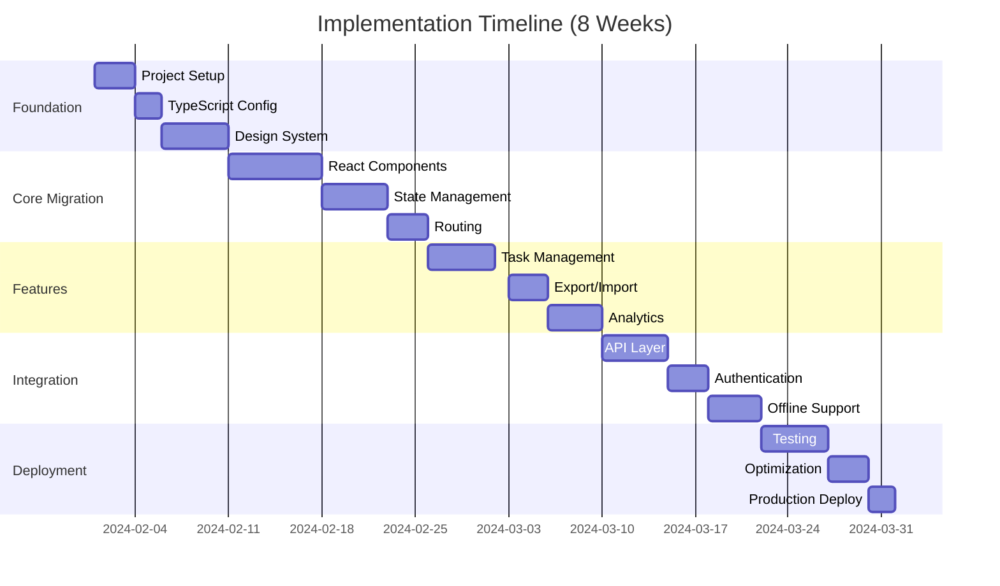

# MADLAB Web App Implementation Roadmap

## 🎯 Overview

This document provides a practical, step-by-step guide to transform the current MADLAB dashboard into a robust web application following the architecture defined in ARCHITECTURE.md.

---

## 📅 Timeline Overview



---

## Week 1-2: Foundation Setup

### Day 1-3: Project Initialization

```bash
# Create new React app with Vite
npm create vite@latest madlab-webapp -- --template react-ts

# Install core dependencies
cd madlab-webapp
npm install react@18.3.1 react-dom@18.3.1
npm install -D @types/react @types/react-dom
npm install -D typescript@5.3.3 @vitejs/plugin-react-swc

# State management
npm install zustand @tanstack/react-query

# Routing
npm install react-router-dom@6.22.0

# UI Libraries
npm install @radix-ui/react-dialog @radix-ui/react-dropdown-menu
npm install tailwindcss@3.4.1 postcss autoprefixer
npm install clsx tailwind-merge

# Form handling
npm install react-hook-form zod @hookform/resolvers

# Utilities
npm install date-fns immer axios
```

### Day 4-5: TypeScript Configuration

```typescript
// tsconfig.json
{
  "compilerOptions": {
    "target": "ES2022",
    "lib": ["ES2022", "DOM", "DOM.Iterable"],
    "module": "ESNext",
    "skipLibCheck": true,
    
    /* Bundler mode */
    "moduleResolution": "bundler",
    "allowImportingTsExtensions": true,
    "resolveJsonModule": true,
    "isolatedModules": true,
    "noEmit": true,
    "jsx": "react-jsx",
    
    /* Linting */
    "strict": true,
    "noUnusedLocals": true,
    "noUnusedParameters": true,
    "noFallthroughCasesInSwitch": true,
    
    /* Path aliases */
    "baseUrl": ".",
    "paths": {
      "@/*": ["src/*"],
      "@components/*": ["src/shared/components/*"],
      "@features/*": ["src/features/*"],
      "@hooks/*": ["src/shared/hooks/*"],
      "@utils/*": ["src/shared/utils/*"],
      "@types/*": ["src/shared/types/*"]
    }
  },
  "include": ["src"],
  "references": [{ "path": "./tsconfig.node.json" }]
}
```

### Day 6-10: Design System Setup

```typescript
// src/design-system/tokens/colors.ts
export const colors = {
  primary: {
    50: '#eef2ff',
    100: '#e0e7ff',
    500: '#6366f1',
    600: '#4f46e5',
    700: '#4338ca',
  },
  gray: {
    50: '#f9fafb',
    100: '#f3f4f6',
    900: '#111827',
  },
  semantic: {
    success: '#10b981',
    warning: '#f59e0b',
    error: '#ef4444',
    info: '#3b82f6',
  }
} as const;

// src/design-system/components/Button/Button.tsx
import { forwardRef } from 'react';
import { cva, type VariantProps } from 'class-variance-authority';
import { cn } from '@/utils/cn';

const buttonVariants = cva(
  'inline-flex items-center justify-center rounded-md font-medium transition-colors focus-visible:outline-none focus-visible:ring-2 disabled:pointer-events-none disabled:opacity-50',
  {
    variants: {
      variant: {
        primary: 'bg-primary-600 text-white hover:bg-primary-700',
        secondary: 'bg-gray-100 text-gray-900 hover:bg-gray-200',
        outline: 'border border-gray-300 bg-transparent hover:bg-gray-50',
        ghost: 'hover:bg-gray-100 hover:text-gray-900',
      },
      size: {
        sm: 'h-9 px-3 text-sm',
        md: 'h-10 px-4',
        lg: 'h-11 px-8',
      },
    },
    defaultVariants: {
      variant: 'primary',
      size: 'md',
    },
  }
);

export interface ButtonProps
  extends React.ButtonHTMLAttributes<HTMLButtonElement>,
    VariantProps<typeof buttonVariants> {
  isLoading?: boolean;
}

export const Button = forwardRef<HTMLButtonElement, ButtonProps>(
  ({ className, variant, size, isLoading, children, ...props }, ref) => {
    return (
      <button
        ref={ref}
        className={cn(buttonVariants({ variant, size, className }))}
        disabled={isLoading}
        {...props}
      >
        {isLoading ? <Spinner className="mr-2" /> : null}
        {children}
      </button>
    );
  }
);
```

---

## Week 3-4: Core Feature Migration

### State Management Implementation

```typescript
// src/features/tasks/stores/taskStore.ts
import { create } from 'zustand';
import { devtools, persist } from 'zustand/middleware';
import { immer } from 'zustand/middleware/immer';

interface TaskState {
  tasks: Task[];
  filters: TaskFilters;
  view: 'grid' | 'list';
  collapsedPhases: Set<string>;
  
  // Actions
  setTasks: (tasks: Task[]) => void;
  updateTask: (id: string, updates: Partial<Task>) => void;
  setFilter: (key: keyof TaskFilters, value: any) => void;
  togglePhase: (phaseId: string) => void;
  setView: (view: 'grid' | 'list') => void;
}

export const useTaskStore = create<TaskState>()(
  devtools(
    persist(
      immer((set) => ({
        tasks: [],
        filters: {
          search: '',
          assignee: null,
          difficulty: null,
          phase: null,
          duration: null,
        },
        view: 'list',
        collapsedPhases: new Set(),
        
        setTasks: (tasks) =>
          set((state) => {
            state.tasks = tasks;
          }),
          
        updateTask: (id, updates) =>
          set((state) => {
            const task = state.tasks.find((t) => t.id === id);
            if (task) {
              Object.assign(task, updates);
            }
          }),
          
        setFilter: (key, value) =>
          set((state) => {
            state.filters[key] = value;
          }),
          
        togglePhase: (phaseId) =>
          set((state) => {
            if (state.collapsedPhases.has(phaseId)) {
              state.collapsedPhases.delete(phaseId);
            } else {
              state.collapsedPhases.add(phaseId);
            }
          }),
          
        setView: (view) =>
          set((state) => {
            state.view = view;
          }),
      })),
      {
        name: 'task-storage',
        partialize: (state) => ({
          view: state.view,
          collapsedPhases: Array.from(state.collapsedPhases),
        }),
      }
    )
  )
);
```

### API Integration with React Query

```typescript
// src/features/tasks/api/taskQueries.ts
import { useQuery, useMutation, useQueryClient } from '@tanstack/react-query';
import { taskAPI } from '@/infrastructure/api/taskAPI';

export const useTasksQuery = (filters?: TaskFilters) => {
  return useQuery({
    queryKey: ['tasks', filters],
    queryFn: () => taskAPI.getTasks(filters),
    staleTime: 5 * 60 * 1000, // 5 minutes
    gcTime: 10 * 60 * 1000, // 10 minutes
  });
};

export const useUpdateTaskMutation = () => {
  const queryClient = useQueryClient();
  
  return useMutation({
    mutationFn: ({ id, data }: { id: string; data: Partial<Task> }) =>
      taskAPI.updateTask(id, data),
    onMutate: async ({ id, data }) => {
      // Optimistic update
      await queryClient.cancelQueries({ queryKey: ['tasks'] });
      
      const previousTasks = queryClient.getQueryData<Task[]>(['tasks']);
      
      queryClient.setQueryData<Task[]>(['tasks'], (old) => {
        if (!old) return [];
        return old.map((task) =>
          task.id === id ? { ...task, ...data } : task
        );
      });
      
      return { previousTasks };
    },
    onError: (err, variables, context) => {
      // Rollback on error
      if (context?.previousTasks) {
        queryClient.setQueryData(['tasks'], context.previousTasks);
      }
    },
    onSettled: () => {
      queryClient.invalidateQueries({ queryKey: ['tasks'] });
    },
  });
};
```

### Component Migration Example

```typescript
// src/features/tasks/components/TaskCard/TaskCard.tsx
import { memo } from 'react';
import { motion } from 'framer-motion';
import { Card, Badge, Progress } from '@/design-system/components';
import { useTaskActions } from '../../hooks/useTaskActions';
import type { Task } from '../../types';

interface TaskCardProps {
  task: Task;
  view: 'grid' | 'list';
  onSelect?: (task: Task) => void;
}

export const TaskCard = memo<TaskCardProps>(({ task, view, onSelect }) => {
  const { updateStatus, isUpdating } = useTaskActions(task.id);
  
  return (
    <motion.div
      layout
      initial={{ opacity: 0, y: 20 }}
      animate={{ opacity: 1, y: 0 }}
      exit={{ opacity: 0, scale: 0.95 }}
      whileHover={{ scale: 1.02 }}
      whileTap={{ scale: 0.98 }}
    >
      <Card
        className={cn(
          'cursor-pointer transition-all',
          view === 'grid' ? 'p-4' : 'p-3',
          task.status === 'completed' && 'opacity-60'
        )}
        onClick={() => onSelect?.(task)}
      >
        <div className="flex items-start justify-between">
          <div className="flex-1">
            <h3 className="font-semibold text-gray-900">{task.name}</h3>
            <p className="mt-1 text-sm text-gray-600">{task.description}</p>
          </div>
          
          <Badge variant={getDifficultyVariant(task.difficulty)}>
            Level {task.difficulty}
          </Badge>
        </div>
        
        <div className="mt-4 flex items-center justify-between">
          <div className="flex items-center gap-2">
            <Avatar src={task.assignee.avatar} alt={task.assignee.name} />
            <span className="text-sm font-medium">{task.assignee.name}</span>
          </div>
          
          <div className="flex items-center gap-2">
            <Clock className="h-4 w-4 text-gray-400" />
            <span className="text-sm text-gray-600">{task.hours}h</span>
          </div>
        </div>
        
        {task.dependencies.length > 0 && (
          <div className="mt-3">
            <DependencyIndicator count={task.dependencies.length} />
          </div>
        )}
        
        <Progress
          value={task.progress}
          className="mt-3"
          showLabel
        />
      </Card>
    </motion.div>
  );
});
```

---

## Week 5-6: Advanced Features

### Real-time Updates with WebSocket

```typescript
// src/infrastructure/websocket/WebSocketManager.ts
export class WebSocketManager {
  private ws: WebSocket | null = null;
  private reconnectAttempts = 0;
  private maxReconnectAttempts = 5;
  private listeners = new Map<string, Set<Function>>();
  
  connect(url: string) {
    this.ws = new WebSocket(url);
    
    this.ws.onopen = () => {
      console.log('WebSocket connected');
      this.reconnectAttempts = 0;
      this.emit('connected');
    };
    
    this.ws.onmessage = (event) => {
      const data = JSON.parse(event.data);
      this.emit(data.type, data.payload);
    };
    
    this.ws.onclose = () => {
      this.emit('disconnected');
      this.attemptReconnect();
    };
  }
  
  private attemptReconnect() {
    if (this.reconnectAttempts < this.maxReconnectAttempts) {
      this.reconnectAttempts++;
      const delay = Math.min(1000 * Math.pow(2, this.reconnectAttempts), 30000);
      setTimeout(() => this.connect(this.url), delay);
    }
  }
  
  on(event: string, callback: Function) {
    if (!this.listeners.has(event)) {
      this.listeners.set(event, new Set());
    }
    this.listeners.get(event)!.add(callback);
  }
  
  emit(event: string, data?: any) {
    const callbacks = this.listeners.get(event);
    if (callbacks) {
      callbacks.forEach(callback => callback(data));
    }
  }
}
```

### Service Worker for Offline Support

```typescript
// src/service-worker.ts
import { precacheAndRoute } from 'workbox-precaching';
import { registerRoute } from 'workbox-routing';
import { StaleWhileRevalidate, NetworkFirst } from 'workbox-strategies';

// Precache all static assets
precacheAndRoute(self.__WB_MANIFEST);

// API calls - Network first, fallback to cache
registerRoute(
  ({ url }) => url.pathname.startsWith('/api/'),
  new NetworkFirst({
    cacheName: 'api-cache',
    networkTimeoutSeconds: 5,
    plugins: [
      {
        cacheWillUpdate: async ({ response }) => {
          if (response && response.status === 200) {
            return response;
          }
          return null;
        },
      },
    ],
  })
);

// Static assets - Stale while revalidate
registerRoute(
  ({ request }) =>
    request.destination === 'style' ||
    request.destination === 'script' ||
    request.destination === 'image',
  new StaleWhileRevalidate({
    cacheName: 'static-cache',
  })
);

// Handle offline fallback
self.addEventListener('fetch', (event) => {
  if (event.request.mode === 'navigate') {
    event.respondWith(
      fetch(event.request).catch(() => {
        return caches.match('/offline.html');
      })
    );
  }
});
```

---

## Week 7-8: Testing & Deployment

### Testing Setup

```typescript
// vitest.config.ts
import { defineConfig } from 'vitest/config';
import react from '@vitejs/plugin-react';
import path from 'path';

export default defineConfig({
  plugins: [react()],
  test: {
    globals: true,
    environment: 'jsdom',
    setupFiles: './src/test/setup.ts',
    coverage: {
      reporter: ['text', 'json', 'html'],
      exclude: [
        'node_modules/',
        'src/test/',
      ],
    },
  },
  resolve: {
    alias: {
      '@': path.resolve(__dirname, './src'),
    },
  },
});

// src/test/setup.ts
import '@testing-library/jest-dom';
import { cleanup } from '@testing-library/react';
import { afterEach } from 'vitest';

afterEach(() => {
  cleanup();
});
```

### E2E Testing with Playwright

```typescript
// e2e/task-management.spec.ts
import { test, expect } from '@playwright/test';

test.describe('Task Management', () => {
  test.beforeEach(async ({ page }) => {
    await page.goto('/');
    await page.waitForLoadState('networkidle');
  });
  
  test('should filter tasks by assignee', async ({ page }) => {
    // Select assignee filter
    await page.selectOption('#assignee-filter', 'Aldo');
    
    // Verify filtered results
    const tasks = page.locator('[data-testid="task-card"]');
    await expect(tasks).toHaveCount(24);
    
    // Verify all tasks are assigned to Aldo
    for (const task of await tasks.all()) {
      await expect(task.locator('.assignee-name')).toHaveText('Aldo');
    }
  });
  
  test('should switch between grid and list view', async ({ page }) => {
    // Start in list view
    await expect(page.locator('.phase-content')).toHaveClass(/view-list/);
    
    // Switch to grid view
    await page.click('[data-testid="grid-view-btn"]');
    await expect(page.locator('.phase-content')).toHaveClass(/view-grid/);
    
    // Verify layout changed
    const taskContainer = page.locator('.phase-content').first();
    await expect(taskContainer).toHaveCSS('display', 'grid');
  });
});
```

### CI/CD Pipeline

```yaml
# .github/workflows/ci.yml
name: CI/CD Pipeline

on:
  push:
    branches: [main, develop]
  pull_request:
    branches: [main]

jobs:
  lint:
    runs-on: ubuntu-latest
    steps:
      - uses: actions/checkout@v4
      - uses: actions/setup-node@v4
        with:
          node-version: '20'
          cache: 'npm'
      - run: npm ci
      - run: npm run lint
      - run: npm run type-check
      
  test:
    runs-on: ubuntu-latest
    steps:
      - uses: actions/checkout@v4
      - uses: actions/setup-node@v4
        with:
          node-version: '20'
          cache: 'npm'
      - run: npm ci
      - run: npm run test:unit -- --coverage
      - uses: codecov/codecov-action@v3
        with:
          files: ./coverage/coverage-final.json
          
  e2e:
    runs-on: ubuntu-latest
    steps:
      - uses: actions/checkout@v4
      - uses: actions/setup-node@v4
      - run: npm ci
      - run: npx playwright install --with-deps
      - run: npm run build
      - run: npm run test:e2e
      - uses: actions/upload-artifact@v3
        if: always()
        with:
          name: playwright-report
          path: playwright-report/
          
  build:
    needs: [lint, test]
    runs-on: ubuntu-latest
    steps:
      - uses: actions/checkout@v4
      - uses: actions/setup-node@v4
      - run: npm ci
      - run: npm run build
      - run: npm run build:analyze
      - uses: actions/upload-artifact@v3
        with:
          name: dist
          path: dist/
          
  deploy:
    needs: [build, e2e]
    if: github.ref == 'refs/heads/main'
    runs-on: ubuntu-latest
    environment: production
    steps:
      - uses: actions/download-artifact@v3
        with:
          name: dist
          path: dist/
      - name: Deploy to Vercel
        run: |
          npm i -g vercel
          vercel --prod --token=${{ secrets.VERCEL_TOKEN }}
```

---

## 🚀 Quick Start Commands

```bash
# Development
npm run dev           # Start dev server
npm run storybook     # Component documentation
npm run test:watch    # Run tests in watch mode

# Building
npm run build         # Production build
npm run preview       # Preview production build
npm run analyze       # Bundle analysis

# Testing
npm run test          # Run all tests
npm run test:unit     # Unit tests only
npm run test:e2e      # E2E tests
npm run test:coverage # Coverage report

# Quality
npm run lint          # ESLint
npm run type-check    # TypeScript checking
npm run format        # Prettier formatting

# Deployment
npm run deploy:staging    # Deploy to staging
npm run deploy:production # Deploy to production
```

---

## 📋 Migration Checklist

### Phase 1: Foundation ✓
- [ ] Project setup with Vite + React + TypeScript
- [ ] Configure path aliases and TypeScript
- [ ] Set up ESLint + Prettier
- [ ] Install and configure Tailwind CSS
- [ ] Create design system components
- [ ] Set up Storybook for documentation

### Phase 2: Core Features ✓
- [ ] Implement Zustand stores
- [ ] Set up React Query for API calls
- [ ] Create routing with React Router
- [ ] Migrate task components
- [ ] Implement filter system
- [ ] Add view toggle (grid/list)

### Phase 3: Advanced Features ✓
- [ ] Add real-time updates
- [ ] Implement offline support
- [ ] Create export functionality
- [ ] Add analytics dashboard
- [ ] Implement authentication
- [ ] Set up error boundaries

### Phase 4: Testing & QA ✓
- [ ] Unit tests (>80% coverage)
- [ ] Integration tests
- [ ] E2E test suite
- [ ] Performance testing
- [ ] Accessibility audit
- [ ] Security review

### Phase 5: Deployment ✓
- [ ] Set up CI/CD pipeline
- [ ] Configure production build
- [ ] Deploy to staging
- [ ] User acceptance testing
- [ ] Deploy to production
- [ ] Monitor and iterate

---

## 🎯 Success Criteria

### Week 1-2 Deliverables
- ✅ New React project initialized
- ✅ TypeScript fully configured
- ✅ Design system with 10+ components
- ✅ Storybook documentation live

### Week 3-4 Deliverables
- ✅ All tasks migrated to React
- ✅ State management working
- ✅ Routing implemented
- ✅ Feature parity with current version

### Week 5-6 Deliverables
- ✅ API integration complete
- ✅ Real-time updates working
- ✅ Offline mode functional
- ✅ Performance optimized

### Week 7-8 Deliverables
- ✅ All tests passing
- ✅ CI/CD pipeline running
- ✅ Deployed to production
- ✅ Documentation complete

---

## 📚 Resources

### Documentation
- [React Documentation](https://react.dev)
- [TypeScript Handbook](https://www.typescriptlang.org/docs/)
- [Zustand Documentation](https://docs.pmnd.rs/zustand)
- [React Query Documentation](https://tanstack.com/query)
- [Tailwind CSS](https://tailwindcss.com/docs)

### Tools
- [Vite](https://vitejs.dev)
- [Storybook](https://storybook.js.org)
- [Playwright](https://playwright.dev)
- [Vitest](https://vitest.dev)

### Monitoring
- [Sentry](https://sentry.io) - Error tracking
- [LogRocket](https://logrocket.com) - Session replay
- [Datadog](https://www.datadoghq.com) - APM
- [Google Analytics](https://analytics.google.com) - User analytics

---

This roadmap provides a clear path from the current implementation to a modern, scalable web application. Each phase builds upon the previous one, ensuring a smooth transition without disrupting the existing functionality.